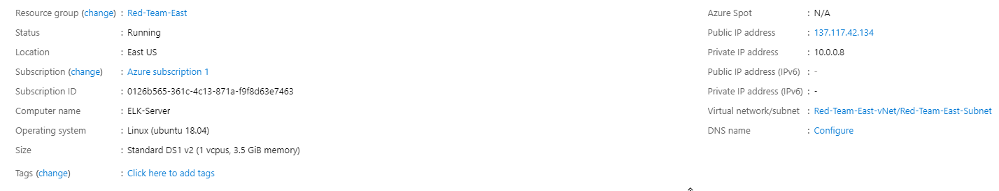

# Configuring and Deploying an ELK Server

For this project, we were asked to create an ELK Server within our already existing virtual network in Azure. ELK stands for Elasticsearch Logstash Kibana which are all different open-source technologies. Elasticsearch is a search and analytics engine. Logstash is a server-side processing pipeline that sends data to Elasticsearch. Finally Kibana is a tool for visualizing elasticsearch data with charts, graphs, etc. These tools work together in a stack to help monitor the network.


## Getting Started

These instructions will help install ELK on a newly created VM within an existing Azure network. It will also recap previous steps if needed to redeploy on the existing network.

### Prerequisites

Before starting the project, we need to have a Resource Group, Virtual Network, Network Security Group, Jump Box with Ansible configured, and a few Webservers deployed in Azure.

The environment is as follows:

- [Azure Network and Commands](Resources/Azure-Network-and-Commands)


```
Jumpbox Admin: RedAdmin
SSH Passphrase: cloud
Public IP: 52.170.157.116 (NOTE: This could change if VM is restarted)
Private IP: 10.0.0.4
Connection CMD: ssh -i ./cloud RedAdmin@PublicIP
Public Key: ssh-rsa AAAAB3NzaC1yc2EAAAADAQABAAABAQCpoZ2GyGf7sdGN53XgOgBXFW9JEaVd/D0mt/4doPzo9YIxbKDEpUMi1skImI5Qn3/URm1GRX6zmwTKeJ9XIU1hwmT46b97TWDxcEHudg50Z2NcynUMFePK7N9I/wPHSistWz2C0UCOm/AJuhx20caLcdCCAhEqd8eC+x0QdsXkjZzO2NGrRPro2w8KgrgPrHXkK0mI75bVLLcnLriEBHL/WhyaBrnkpFm1BFP9C8Hi5Kps3mTATbPqhGqDXkXwQJVvJPpdIw9JEhKoQMa3qOysP9+bsSh4+8Oe6l+BW12z2I8ZngxTWrCvB6KMOoDvQRoQiUZm6VY+p0ncg8XL2pmd
```


```
DVWA-VM1 Admin: RedAdmin
SSH Passphrase: <empty>
Public IP: 40.114.24.119 (NOTE: This is assigned by the load balancer / backend pool)
Private IP: 10.0.0.5
Connection CMD: ssh RedAdmin@10.0.0.5 (NOTE: This is from the Jumpbox)
Public Key: ssh-rsa AAAAB3NzaC1yc2EAAAADAQABAAABAQDMNVBkZAaNHvR9d74HYY3XoiRU8aVD0KnIoaVTRghKsQIExDSbP+PIhVaLF9yzBaezgDTT2BpBVqs9dy3mYEBqVkZpMYWl3SPllYSRyR9rhfrQ0DfVT2C5RGNjJR9JHXzeKn+XbN3EogKdRMIQZEnUPDS5Xmcb52Hzudz2NGwIEz2EaMaa+5Z4gukrGmUzSCwob1B0nWCPlIpXoOctrU9mGvY3fBQz6li3J8QG9/5al7mPg6BRsujp44o7NAF1CTqqi3S3zD4Igsb+HaScY/qlieA9PpUEuyc0jw2PlhZFEUu6qyD7kg1TA2Uq99r7BFW8GRwh//nq+tgfw6Wu+CpD
```


```
DVWA-VM2 Admin: RedAdmin
SSH Passphrase: <empty>
Public IP: 40.114.24.119 (NOTE: This is assigned by the load balancer / backend pool)
Private IP: 10.0.0.6
Connection CMD: ssh RedAdmin@10.0.0.6 (NOTE: This is from the Jumpbox)
Public Key: ssh-rsa AAAAB3NzaC1yc2EAAAADAQABAAABAQDMNVBkZAaNHvR9d74HYY3XoiRU8aVD0KnIoaVTRghKsQIExDSbP+PIhVaLF9yzBaezgDTT2BpBVqs9dy3mYEBqVkZpMYWl3SPllYSRyR9rhfrQ0DfVT2C5RGNjJR9JHXzeKn+XbN3EogKdRMIQZEnUPDS5Xmcb52Hzudz2NGwIEz2EaMaa+5Z4gukrGmUzSCwob1B0nWCPlIpXoOctrU9mGvY3fBQz6li3J8QG9/5al7mPg6BRsujp44o7NAF1CTqqi3S3zD4Igsb+HaScY/qlieA9PpUEuyc0jw2PlhZFEUu6qyD7kg1TA2Uq99r7BFW8GRwh//nq+tgfw6Wu+CpD
```


```
ELK-Server Admin: RedAdmin
SSH Passphrase: <empty>
Public IP: 137.117.42.134 (NOTE: This could change if VM is restarted)
Private IP: 10.0.0.8
Connection CMD: ssh RedAdmin@10.0.0.8 (NOTE: This is from the Jumpbox)
Public Key: ssh-rsa AAAAB3NzaC1yc2EAAAADAQABAAABAQDMNVBkZAaNHvR9d74HYY3XoiRU8aVD0KnIoaVTRghKsQIExDSbP+PIhVaLF9yzBaezgDTT2BpBVqs9dy3mYEBqVkZpMYWl3SPllYSRyR9rhfrQ0DfVT2C5RGNjJR9JHXzeKn+XbN3EogKdRMIQZEnUPDS5Xmcb52Hzudz2NGwIEz2EaMaa+5Z4gukrGmUzSCwob1B0nWCPlIpXoOctrU9mGvY3fBQz6li3J8QG9/5al7mPg6BRsujp44o7NAF1CTqqi3S3zD4Igsb+HaScY/qlieA9PpUEuyc0jw2PlhZFEUu6qyD7kg1TA2Uq99r7BFW8GRwh//nq+tgfw6Wu+CpD
```


The ansible configuration file should look similar to the following and the host file should include the internal IPs for the webservers and elkserver machines:
- [Ansible Config File](Resources/ansible.cfg)
- [Hosts](Resources/hosts)

### Architecture and Security

The following image displays the overall architecture of the Azure environment:


The following is the topology within Azure:


The Load Balancer is configured as follows:


The following rules are in place within the network security group:


## Installing and Configuring ELK Server

After creating a new VM in Azure for the installation of the ELK Stack, we need to create a playbook in our Jump Box Ansible to install the necessary infrastructure to download and launch it.
Refer to the following playbook for an example:
- [ELK-Playbook](Resources/elkconf.yml)

### Results

If the playbook outputs as expected, it will look like the following:


## Installing and Configuring Filebeat

Now that ELK is up and running on the ELK-Server, we can begin installing Filebeat and enable the system module to collect system logs for the webservers. First we must edit the filebeat configuraiton file with the IP of the ELK-Server. Then we can run the playbook to install on the webservers.
- [Filebeat-Configuration](Resources/filebeat-configuration.yml)
- [Filebeat-Playbook](Resources/filebeat-playbook.yml)

### Results
This should give us the results as follows:


Can check the status in our browser to confirm the module:


## Installing and Configuring Metricbeat
We can also install Metricbeat for docker by using the following configuration file and playbook:
- [Metricbeat-Configuration](Resources/metricbeat-configuration.yml)
- [Metricbeat-Playbook](Resources/metricbeat-playbook.yml)

### Results
This should give us the results as follows:


Can check the status in our browser to confirm the module:


