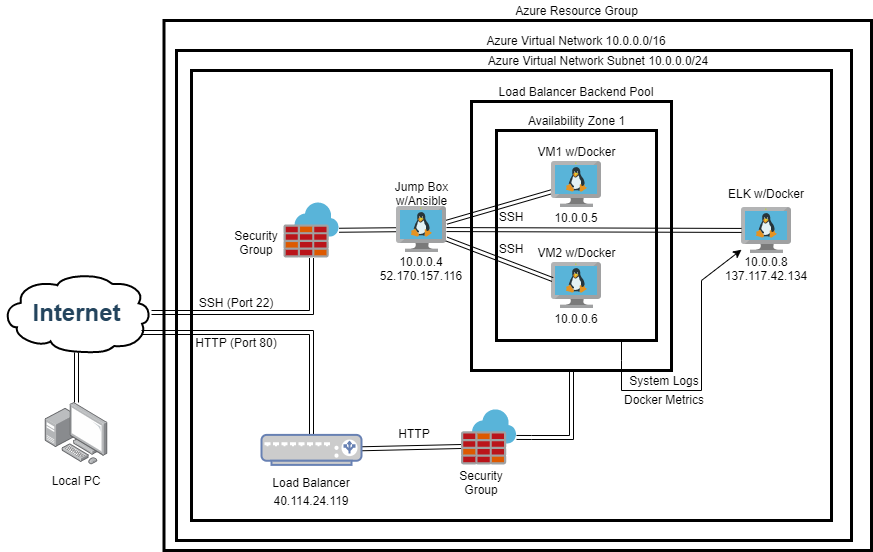
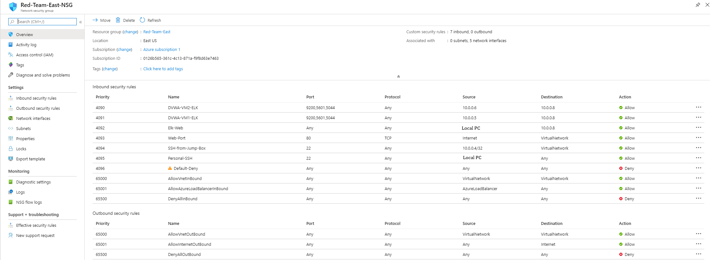
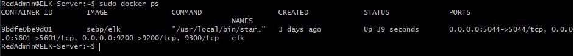

## Automated ELK Stack Deployment

The files in this repository were used to configure the network depicted below.

These files have been tested and used to generate a live ELK deployment on Azure. They can be used to either recreate the entire deployment pictured above. Alternatively, select portions of the Resource files may be used to install only certain pieces of it, such as Filebeat.

  - [Ansible Config File](Resources/ansible.cfg)
  - [Hosts](Resources/hosts)
  - [ELK-Playbook](Resources/elkconf.yml)
  - [Filebeat-Configuration](Resources/filebeat-configuration.yml)
  - [Filebeat-Playbook](Resources/filebeat-playbook.yml)
  - [Metricbeat-Configuration](Resources/metricbeat-configuration.yml)
  - [Metricbeat-Playbook](Resources/metricbeat-playbook.yml)

This document contains the following details:
- Description of the Topology
- Access Policies
- ELK Configuration
  - Beats in Use
  - Machines Being Monitored
- How to Use the Ansible Build

### Description of the Topology

The main purpose of this network is to expose a load-balanced and monitored instance of DVWA, the D*mn Vulnerable Web Application.

Load balancing ensures that the application will be highly available, in addition to restricting access to the network.

Integrating an ELK server allows users to easily monitor the vulnerable VMs for changes to the docker containers and system logs.

The configuration details of each machine may be found below.

| Name        | Function | IP Address | Operating System |
|-------------|----------|------------|------------------|
| Jump Box    | Gateway  | 10.0.0.4   | Linux            |
| DVWA-VM1    | Server   | 10.0.0.5   | Linux            |
| DVWA-VM     | Server   | 10.0.0.6   | Linux            |
| ELK-Server  | Server   | 10.0.0.8   | Linux            |

### Access Policies

The machines on the internal network are not exposed to the public Internet. 

Only the Jump Box machine can accept connections from the Internet. Access to this machine is only allowed from the following IP addresses:
- Local PC

Machines within the network can only be accessed by the Jump Box.
- 10.0.0.4

A summary of the access policies in place can be found in the table below.

| Name       | Publicly Accessible | Allowed IP Addresses                                                            |
|------------|---------------------|---------------------------------------------------------------------------------|
| Jump Box   | No                  | Local PC                                                                        |
| DVWA-VM1   | Yes (Port 80)       | 10.0.0.4                                                                        |
| DVWA-VM2   | Yes (Port 80)       | 10.0.0.4                                                                        |
| ELK-Server | No                  | 10.0.0.4, 10.0.0.5 (ELK Ports), 10.0.0.6 (ELK Ports), Local PC (ELK Ports)      |

### Elk Configuration

Ansible was used to automate configuration of the ELK machine. No configuration was performed manually, which is advantageous because the playbooks can be used to redeploy or deploy to new machines maintaining the infrastructure as code.

The playbook implements the following tasks:
- Looks in the host configuration of ansible to determine what elkservers are listed by internal IP
- Installs docker.io, pip, docker python module
- Increases the virtual memory cound to 262144
- Downloads and launches a docker ELK container

The following screenshot displays the result of running `docker ps` after successfully configuring the ELK instance.

### Target Machines & Beats
This ELK server is configured to monitor the following machines:
- 10.0.0.5
- 10.0.0.6

We have installed the following Beats on these machines:
- Filebeat
- Metricbeat

These Beats allow us to collect the following information from each machine:
- Filebeat collects data about the file system. Specifically in this project we allowed collection of system logs.
- Metricbeat collects machine metrics that might be of interest. For this project we enabled the docker module. This would collect information on the containers of the machines.

### Using the Playbook
In order to use the playbook, you will need to have an Ansible control node already configured. Assuming you have such a control node provisioned: 

SSH into the control node and follow the steps below:
- Copy the elkconf.yml file to the ansible container.
- Update the ansible hosts file to include the IP of the webeservers and elkservers
- Run the playbook, and navigate to the public IP of the ELK server to check that the installation worked as expected.

Additional configuration information and commands can be found in the following files:
- [Azure Network and Commands](Resources/Azure-Network-and-Commands)
- [Additional README](Arch-README.md)